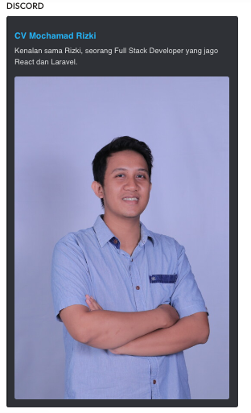

# 🧑‍💻 My First Web Portfolio (HTML Only)

Hey there! 👋  
Welcome to my very first web project built with just **HTML** — no CSS, no JavaScript, just pure structure! This is part of my learning journey to become a Web Developer.

---

## 📌 What's Inside?

This is a simple one-page CV website that includes:

- 🏷️ Semantic HTML tags (`<header>`, `<section>`, `<footer>`, etc.)
- 📝 My basic information (name, skills, education, experience)
- 🔗 Links to my social media
- 🖼️ Profile picture
- 🌐 SEO-friendly meta tags
- 📸 Open Graph tags (so it looks nice when shared)
- ⭐ Favicon to make it look professional!

---

## 🎯 Why I Made This

I built this to:

- Practice using semantic HTML
- Learn about SEO and how to use meta tags
- Understand how to make websites ready for sharing on social media
- Prepare myself for real-world web development

---

## 🚀 How to View This

1. Download or clone the repo:
   ```bash
   git clone https://github.com/rizkilabs/Single-Page-CV.git
2. Open `index.html` in your browser. That’s it! 💥

---

## 🔍 Try It Online

Want to see it live?
Check out the [GitHub Pages version here]([https://rizkilabs.github.io/Single-Page-CV/) 🌍

> Replace the link above with your actual GitHub Pages URL if you publish it.

---

## 🛠️ Built With

* HTML5 (just that, plain and clean)
* 💡 My brain, caffeine, and curiosity

---

## 📸 Preview

Here's a quick preview of how it looks when shared on social media (thanks to Open Graph tags):



---

## 🙋‍♂️ About Me

Hi! I’m **Rizki** – an aspiring full-stack web developer, currently learning the basics step by step.
Let’s connect on [LinkedIn](https://linkedin.com/in/rizkilabs)

---

## 📫 Contact Me

If you want to give feedback, or just say hi 👋 <br>
Email me: [rizkilabs.dev@gmail.com](mailto:rizkilabs.dev@gmail.com)

---

## ✅ Checklist

* [x] Semantic HTML ✅
* [x] SEO Meta Tags ✅
* [x] Open Graph Tags ✅
* [x] Favicon ✅
* [x] Validated with W3C ✅
* [x] Looks clean and makes sense ✅

---

Thanks for stopping by! 🙌 <br>
If you like this, feel free to give it a ⭐ on GitHub!
